# PLL_OSU180nm_VSD
Documentation of work done for On-Chip clock multiplier / PLL workshop for OSU 180nm node by VSD for VSD Open 2021

---

## Table of contents

- [PLL_OSU180nm_VSD](#pll_osu180nm_vsd)
  - [Table of contents](#table-of-contents)
  - [Introduction](#introduction)
  - [Tools used](#tools-used)
  - [Theory](#theory)
    - [Phase Locked Loop](#phase-locked-loop)
      - [Clock multiplier using PLL](#clock-multiplier-using-pll)
      - [Our implementation](#our-implementation)
      - [Phase frequency detector](#phase-frequency-detector)
      - [Charge pump and RC filter](#charge-pump-and-rc-filter)
      - [Voltage Controlled Oscillator](#voltage-controlled-oscillator)
      - [Frequency divider](#frequency-divider)
- [Specification](#specification)
- [Pre-layout simulation](#pre-layout-simulation)
    - [1) Inverter (example)](#1-inverter-example)
      - [Esim netlist](#esim-netlist)
      - [Modifications](#modifications)
      - [Running simulation](#running-simulation)
    - [2) NAND gates](#2-nand-gates)
      - [2 input NAND](#2-input-nand)
      - [3 input NAND](#3-input-nand)
      - [4 input NAND](#4-input-nand)
    - [3) Phase detector](#3-phase-detector)
    - [4) Phase detector with RC filter and charge pump](#4-phase-detector-with-rc-filter-and-charge-pump)
    - [5) Voltage Controlled Oscillator](#5-voltage-controlled-oscillator)
    - [6) Clock divider](#6-clock-divider)
    - [Pre-layout simulation of whole circuit](#pre-layout-simulation-of-whole-circuit)
- [Physical design](#physical-design)
    - [Magic tips](#magic-tips)
    - [1) Phase detector](#1-phase-detector)
    - [2) Voltage controlled oscillator](#2-voltage-controlled-oscillator)
    - [3) Frequency divider](#3-frequency-divider)
      - [Divide by two](#divide-by-two)
      - [Divide by eight](#divide-by-eight)
    - [4) Multiplexer](#4-multiplexer)
    - [4) Whole PLL](#4-whole-pll)
- [References](#references)


---

## Introduction

- PLL : Phase Locked Loop
- Clock multiplier is a circuit that multiplies the frequency of a clock signal
- It is used in processors for generating variable clock frequencies
- Clock multipliers use PLLs with clock dividers in the feedback loop

---

## Tools used

- ```esim``` : Used to create spice netlists. Developed by FOSSEE group at IITB
- ```Magic``` : An open source layout editor for designing layouts and generating spice netlists from them
- ```ngspice``` : An open source circuit simulator

---

## Theory

### Phase Locked Loop

A phase locked loop is a closed loop feedback system. The output is generated from a voltage controlled oscillator. The phase difference between the oscillator output and required output is measured as the error. This error is low-pass filtered and fed into the VCO. This closed loop feedback system "locks" to the frequency of the input using the phase diffence, giving it the name

Below is an abstract block diagram of the PLL

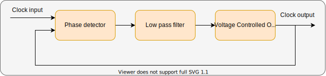

#### Clock multiplier using PLL

A PLL can be used to create a clock multiplier by adding a clock divider in the feedback loop as shown below.

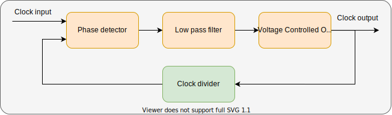

#### Our implementation

Our design has some more blocks.

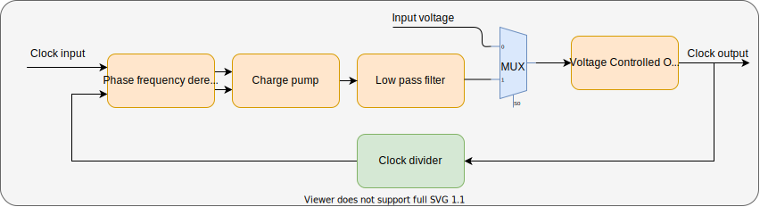

It has a multiplexer in the feedback loop to provide the option of directly feeding a voltage to the VCO. The phase frequency detector 

#### Phase frequency detector

The phase detector measures the phase differencce between the output clock signal and the input clock signal. It is the error computing block from a control systems point of view.


The circuit used here is :

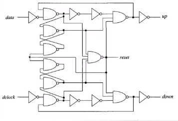

The phase frequency detector has 2 outputs, ```UP``` and ```DOWN```. 

```UP``` being high means the clock is lagging with respect to reference and we need to increase clock frequency

Obviously, ```DOWN``` being high means the clock is leading with respect to reference and we need to decrease the clock frequency

#### Charge pump and RC filter

Charge pump converts the ```UP```, ```DOWN``` signals from the phase frequency detector to an actual voltage that is then low pass filtered and passed to the VCO

Charge pump circuit :

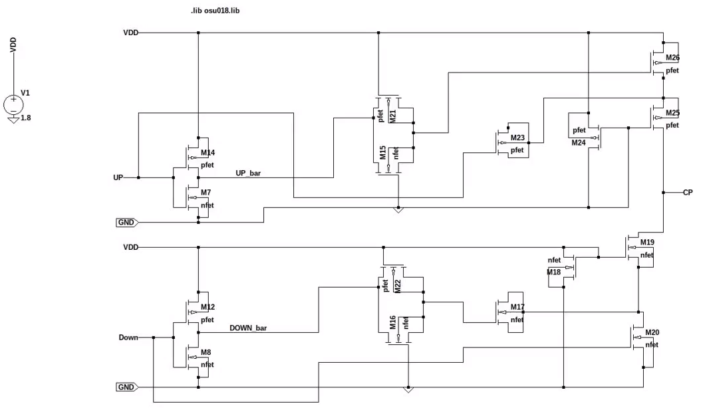

RC low pass filter circuit :

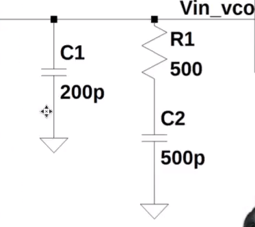

#### Voltage Controlled Oscillator

The VCO here is a ring oscillator. The control voltage is used to vary the supply voltage of the inverters which changes their delays and therefore the frequency of the ring oscillator.

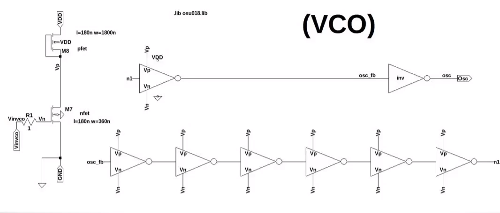

#### Frequency divider

The frequency divider is just a ripple counter using T flip flops that are made from D flip flops (with inverted output fed into input port)

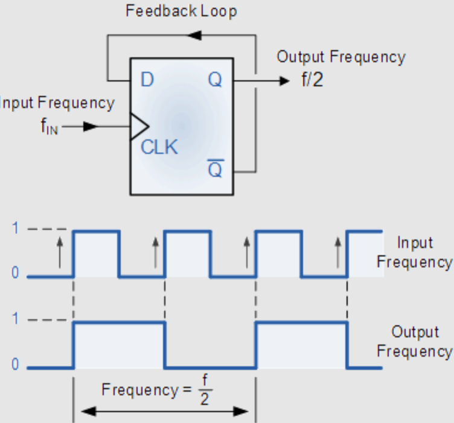

We then give the Q output to another such T flip flop to get a divide by 4 unit. Cascading another divide by 2 unit creates a divide by 8 unit.

---

# Specification

| Parameter | Description                       | Min  | Type        | Max   | Unit | Condition                                                                            |
|-----------|-----------------------------------|------|-------------|-------|------|--------------------------------------------------------------------------------------|
| VDD       | Digital supply voltage            |      | 1.8         |       | V    | T=-40 to 150C                                                                        |
| FCLKREF   | Reference clock frequency         | 5    | 10          | 12.5  | MHz  |                                                                                      |
| FCLKOUT   | Output clock frequency            | 39.7 | 80.91       | 99.81 | MHz  | PLL mode, T=27C, VDD=1.8                                                             |
| FCLKOUT   | Output clock frequency            |      |             |       | MHz  | VCO mode, T=27C, VDD=1.8                                                             |
| DC        | Duty Cycle                        | 48   |             | 52    | %    | T=-40 to 150C                                                                        |
| IBCP      | Bias current for VCO              |      |             |       | uA   |                                                                                      |
| VVCO      | Oscillatror control input voltage | .557 |             | 0.62  | V    | Vin_vco = 0V at t = 0 (.uic)                                                         |
| JRMS      | Jitter (rms)                      |      | future work |       | ps   | PLL mode, FCLKREF = 10MHz                                                            |
| TSET      | Settling Time                     | 5.2  | 5           | 4.6   | us   | start from EN_CP and report 2 values; one at FCLKOUT=40MHz and one at FCLKOUT=100MHz |
| CL        | Load Capacitance                  |      |             |       | pF   |                                                                                      |
| IDDA      | Analog Supply current             |      |             |       | ua   | VVCO=0.8V, VCO mode                                                                  |
| IDDA      | Analog Supply current             |      |             |       | ua   | FCLKREF=10MHz, PLL mode                                                              |
| IDDA      | Analog Supply current             |      |             |       | pa   | EN_VCO=0, EN_CP=0, FCLKREF=0                                                         |
| IDDD      | Digital Supply Current            |      |             |       | uA   | VVCO=0.8V, VCO mode                                                                  |
| IDDD      | Digital Supply Current            |      |             |       | uA   | FCLKREF=10MHz, PLL mode                                                              |
| IDDD      | Digital Supply Current            |      |             |       | uA   | EN_VCO=0, EN_CP=0, FCLKREF=0                                                         |

---

# Pre-layout simulation

First, schematics are made in esim as part of the design process. Then, spice netlists are exported from esim. These need to be modified to add test voltage sources and probes.

Then, we use ngspice to run simulations. This is called pre-layout simulation since this is done before layout design.

---

### 1) Inverter (example)

#### Esim netlist

The netlist generated from esim looks like this : 

File : [```pre_layout/esim/inv101.cir```](pre_layout/esim/inv101.cir)
```
* /home/paras/Desktop/udemypll/prelayout/esim/inv101.cir

* EESchema Netlist Version 1.1 (Spice format) creation date: Sun Jul 25 19:21:36 2021

* To exclude a component from the Spice Netlist add [Spice_Netlist_Enabled] user FIELD set to: N
* To reorder the component spice node sequence add [Spice_Node_Sequence] user FIELD and define sequence: 2,1,0

* Sheet Name: /
M2  vdd in out vdd mosfet_p		
M1  out in GND GND mosfet_n		

.end
```

#### Modifications

We need to modify this and add ```.control``` portion to do transient simulation. We also add voltage sources for power and input (V2 and V1 respectively). We also change the mosfet definitions for the PDK we use and specify the W and L parameters.

File : [```pre_layout/inv101.cir```](pre_layout/inv.cir)
```spice
****************************
*Inverter
***************************

.include osu018.lib

M1 out in GND GND nfet l=180n w=180n
M2 VDD in out VDD pfet l=180n w=360n

V1 in 0 PULSE 0 1.8 10p 50p 50p 100n 200n
v2 VDD 0 1.8


.control
tran 0.01ns 400ns
plot v(in)+2 v(out)
.endc

.end
```

#### Running simulation

We run the simulation by invkiing the command ```ngspice inv.cir``` where ```inv.cir``` is the name of the spice netlist. The output looks like :

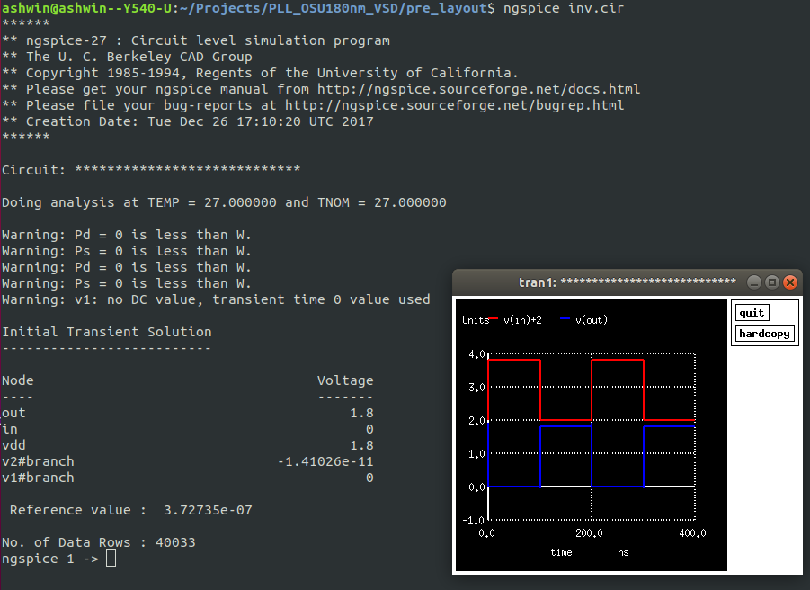

---

### 2) NAND gates

The phase detector requires NAND gate models. We simulate these too using esim and ngspice. The files are 

#### 2 input NAND

File : [pre_layout/nand101.cir](./pre_layout/nand101.cir)

Output : 

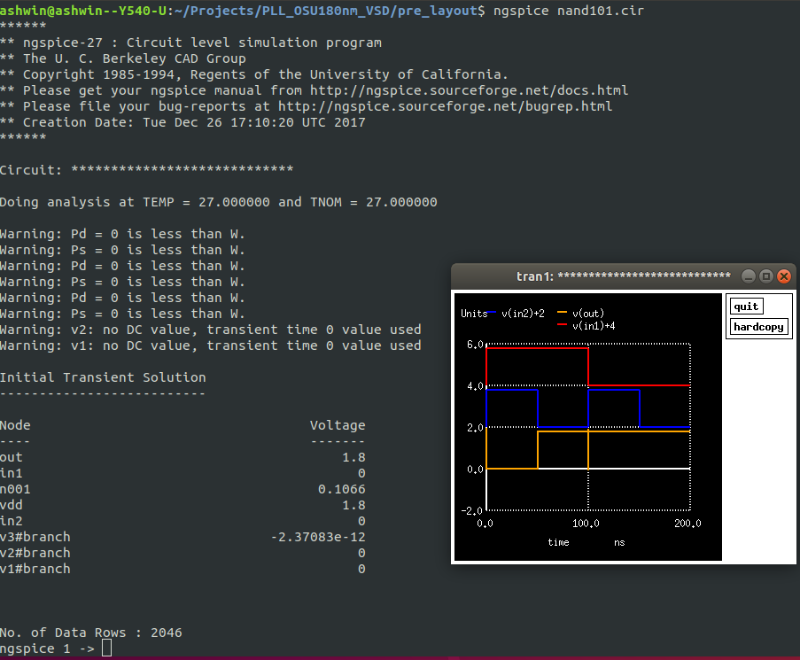

#### 3 input NAND

File : [pre_layout/nand301.cir](./pre_layout/nand101.cir)

Output 

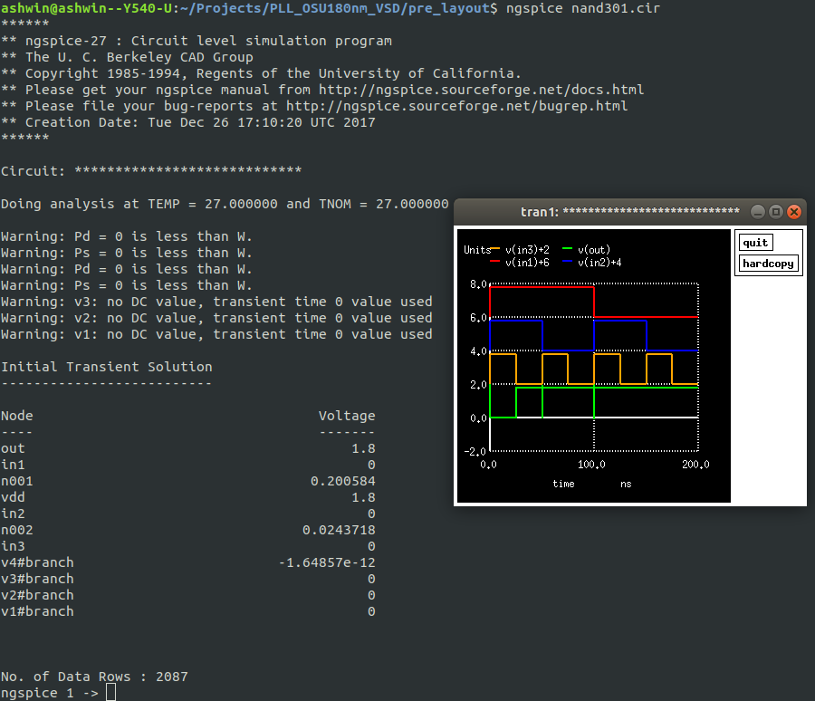

#### 4 input NAND

File : [pre_layout/nand401.cir](pre_layout/nand401.cir)

Output

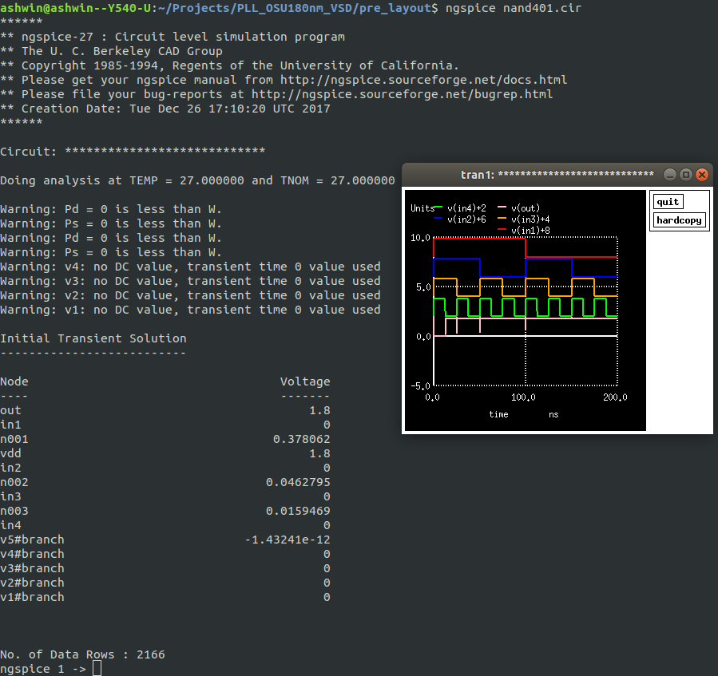

---

### 3) Phase detector

The spice netlist for the phase detector is in this file : [```pre_layout/pfd.cir```](pre_layout/pll.cir)

It uses subcircuits definitions of NAND gates and inverters mentioned before. The subcircuit of the 

Output

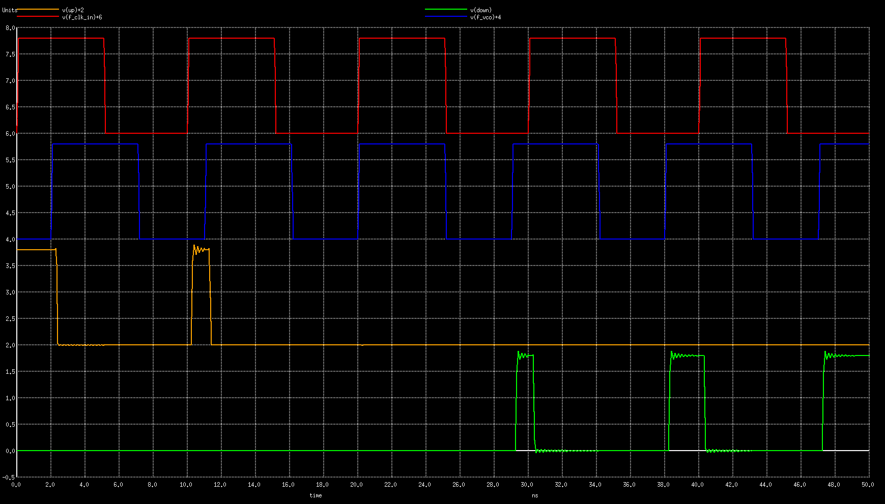

Signals from top to bottom 

1) ```Reference clock```
2) ```VCO clock```
3) ```UP signal```
4) ```DOWN signal```

We can see that when the signal is lagging with respect to reference (at the start), ```UP``` signal becomes high, signaling the VCO to increase frequency to compensate. 

When the signal is leading with respect to reference (at the end), ```DOWN``` signal becomes high, signaling the VCO to reduce frequency to compensate.

Slight ringing noise can also be observed in the output ```UP``` and ```DOWN``` signals.

---

### 4) Phase detector with RC filter and charge pump

A simple RC low pass filter and charge pump is added to the PLL netlist. 

The charge pump is defined as a netlist which is made of MOSFETS and a voltage source

The RC filter part is :

```
C1 Vin_vco 0 200p
C2 N001 0 500p
R1 Vin_vco N001 500
```

The Phase detector from earlier part is also intergrated into a subcircuit : 

```
.subckt pfd_501 f_clk_in f_VCO up down
XX1 N001 N005 N002 vddd 0 nand101
XX2 N002 N008 N006 vddd 0 nand101
XX3 N006 N007 N008 vddd 0 nand101
XX4 N007 N010 N011 vddd 0 nand101
XX5 N011 N009 N010 vddd 0 nand101
XX6 N013 N012 N009 vddd 0 nand101
XX7 f_clk_in N005 vddd 0 inv101
XX8 f_VCO N013 vddd 0 inv101
XX9 N002 N003 vddd 0 inv101
XX10 N003 N004 vddd 0 inv101
XX11 N009 N014 vddd 0 inv101
XX12 N014 N015 vddd 0 inv101
XX13 N004 N006 N007 N001 vddd 0 nand301
XX14 N007 N010 N015 N012 vddd 0 nand301
XX15 N012 down vddd 0 inv101
XX16 N006 N002 N009 N010 vddd 0 N007 nand401
XX17 N001 up vddd 0 inv101
V1 vddd 0 1.8
.ends pfd_501
```

The phase detector consists of a voltage soure and nand gates and inverters. Refer theory part for the schematic

File : [```pre_layout/pfd_full.cir```](pre_layout/pfd_full.cir)

First, we comment out the RC filter to see only the charge pump output.

Output
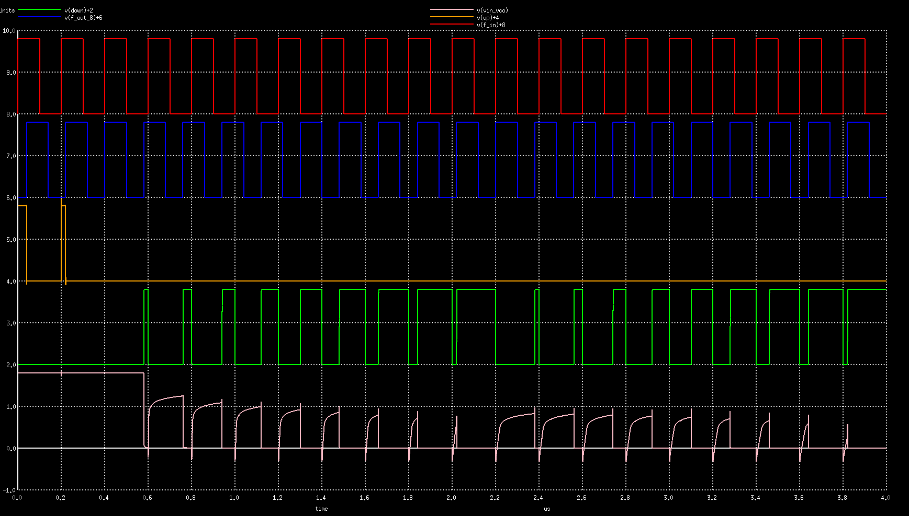

Then, we add the RC filter.

Output
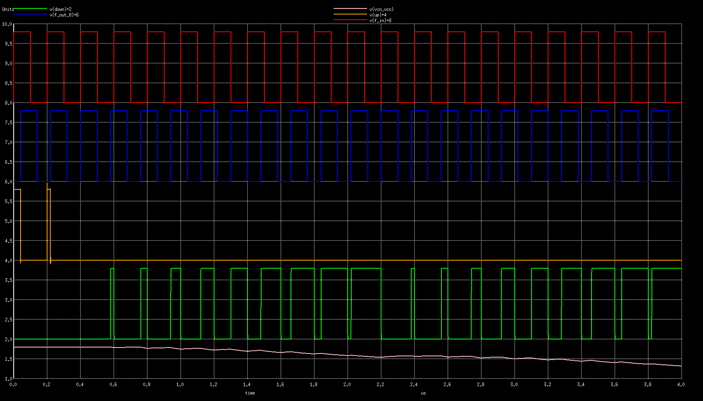

Signals in order from top to bottom

1) ```Reference clock```
2) ```VCO clock```
3) ```UP signal```
4) ```DOWN signal```
5) ```Input to VCO```

Here we can see how the UP and DOWN signals are converted to pulses by the charge pump and to a continuous waveform by the RC filter. This signal is then fed to the VCO.

---

### 5) Voltage Controlled Oscillator

File : [```pre_layout/vco.cir```](pre_layout/vco.cir)

We vary the value of input voltage and view the different output waveforms. The voltage source is

```V2 Vinvco 0 .5```

on line No.45.

We test 3 values : ```0.4```, ```0.5```,  ```0.6```.

Output :

1) For 0.4V input
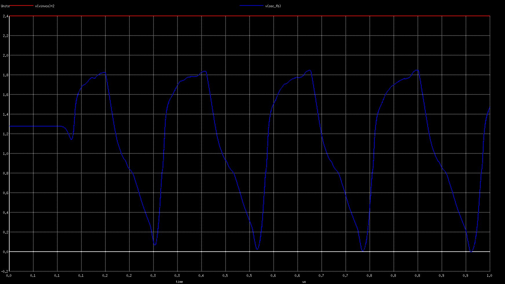

2) 0.5V input
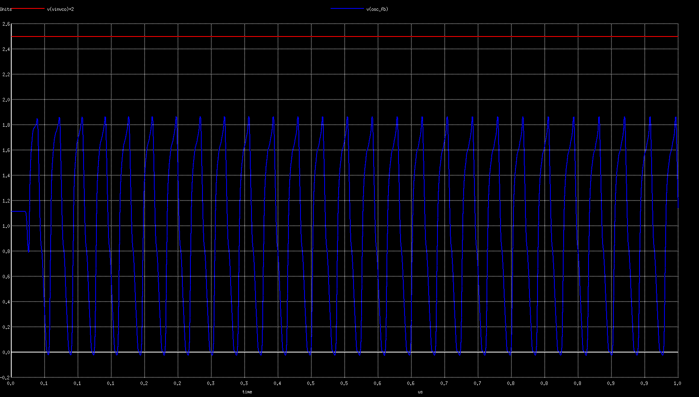

3) 0.6V input
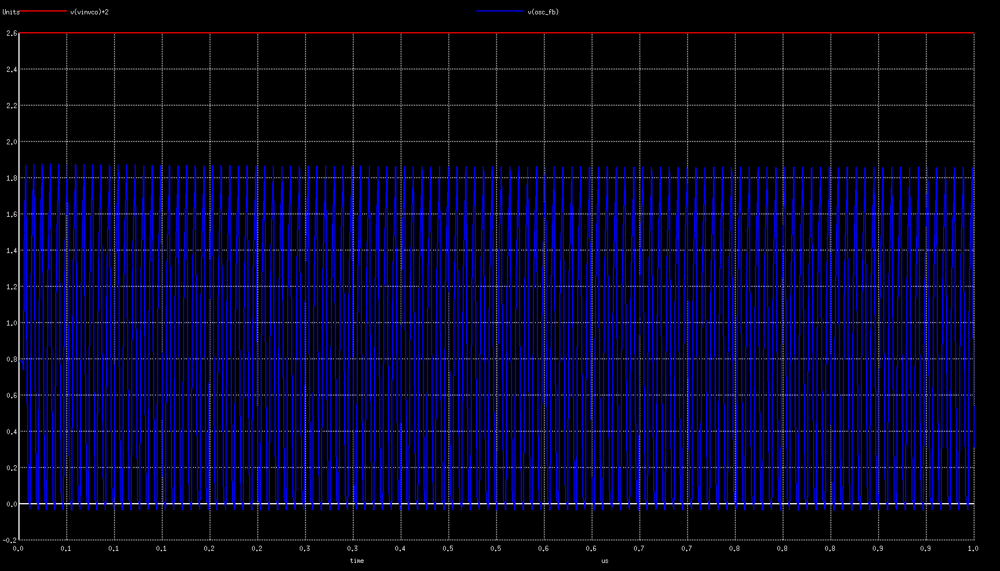

Signals from top to bottom

1) ```Input voltage```
2) ```Oscillator feedback signal```

We can see that as we increase the voltage, the delay of the inverters reduce and so, the ring oscillator frequency increases.

The voltage probed is from inside the ring oscilator and does not have clean transitions. This is fixed by the last inverter and the final output is a clean square wave.

---

### 6) Clock divider

This is a module that demonstrated divide-by-two. We can cascade multiple of these units to create a divide-by-eight unit that we need.

File : [```pre_layout/freq_div.cir```](pre_layout/freq_div.cir)

Output
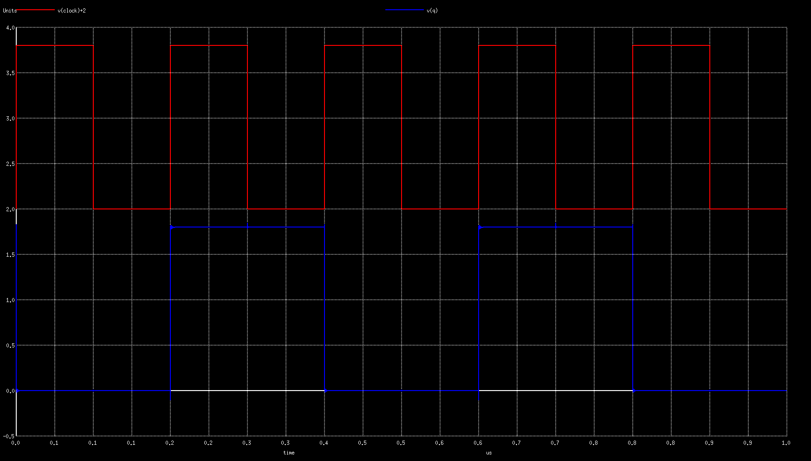

---

### Pre-layout simulation of whole circuit

File : [```pre_layout/pll.ckt```](pre_layout/pll.ckt)

Output
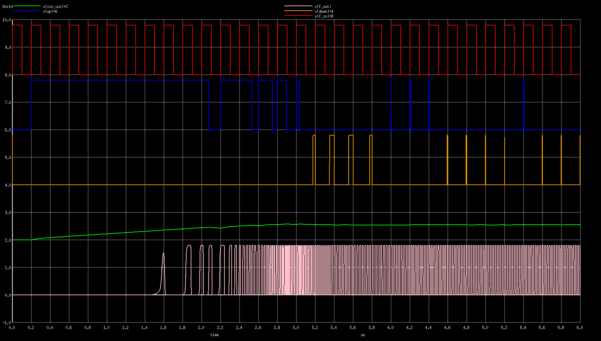

Zoomed in output
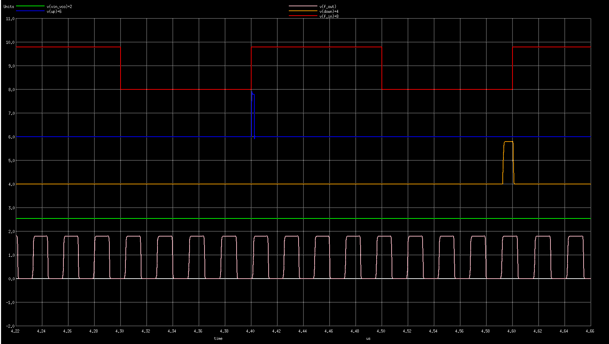

Signals from top to bottom

1) ```Reference clock```
2) ```UP``` signal from phase detector
2) ```DOWN``` signal from phase detector
3) ```Error``` signal given as input to VCO, output of LPF
4) ```Output clock``` from the VCO

We can see that the VCO output slowly reaches the required frequency that is 8 times the reference frequency.

---

# Physical design

Physical design is done using magic. We need a technology file that specifies the DRC rules, types of layers and other such details. This is provided as part of the PDK. Here, we have a file, ```SCN6M_SUBM.10.tech``` which gives us all such details.

When we create a ```example.magic``` file, we open it using the command ```magic example.magic -T SCN6M_SUBM.tech``` provided ```SCN6M_SUBM.10.tech``` is in the same directory.

There are lambda-based design rule checks (DRC) as part of the PDK that are loaded when we load the technology file. They define things like minimumsize of layers, minimum distance between layers and so on.

### Magic tips

- Enable toolbar to see layers
- Enable crosshairs
- Press ```G``` to enable/disable grid
- Press ```z``` to zoom in, ```Z``` to zoom out

- ```u``` to undo and ```U``` to redo
- Left click to select beginning of a region
- Right click to select end of a region
- After selecting a region, middle click on a layer type on right toolbar to fill the region with that type
- DRC errors are seen by highlighted areas. Type ```drc find``` in magic terminal to find all DRC errors
- Selecting an area an middle clicking another area will copy the middle clicked area colors to the selected area
- Seleting an area an ```Ctrl+d`    ``` on another area will remove the area on which ```Ctrl+d``` was pressed from the selected area

- Select layer and type ```label <label_name>``` to label it
- Type ```extract all``` to create netlist
- Type ```ext2spice``` to extract to spice netlist

---

### 1) Phase detector

File : [```post_layout/pfd/pfd.mag```](post_layout/pfd/pfd.mag)

Layout


Output
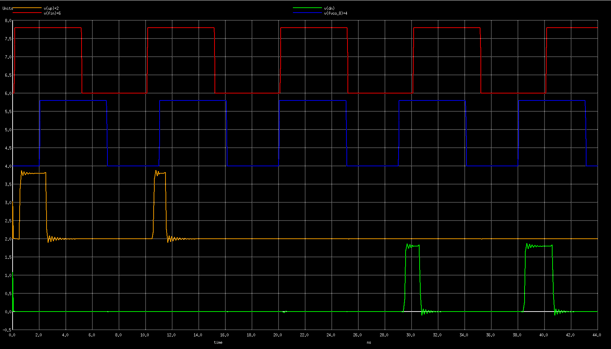

Signals:

1) ```Reference clock```
2) ```VCO clock```
3) ```UP```
4) ```DOWN```

We can see that this is similar to what we saw in the [pre-layout part](#phase-frequency-detector), but has some delay and more ringing due to parasitic elements.

---

### 2) Voltage controlled oscillator

File : [```post_layout/vco/vco101.mag```](post_layout/vco/vco101.mag)

Layout
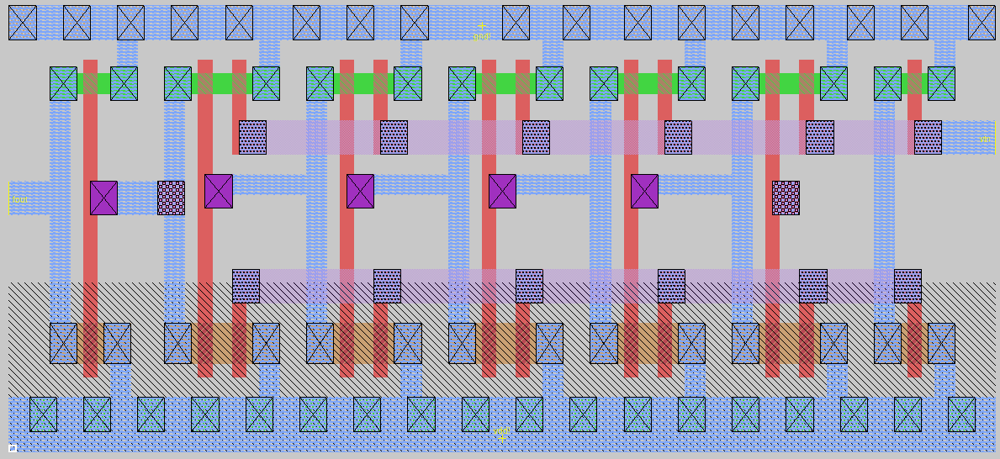

Like the pre-layout simulation, we can also test for different frequencies post-layout. We try for ```0.545V```, ```0.5V```, ```0.6V```

1) 0.5V


2) 0.545V


3) 0.6V
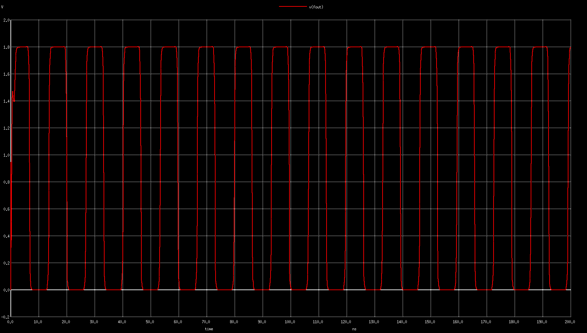

As we increase voltage, the frequency increases.

---

### 3) Frequency divider

We have layouts for divide by 2 block and another layout for divide by 8 block which is 3 cascaded divide by 2 blocks.

#### Divide by two

File : [```post_layout/freqdiv2/freq_divider2.mag```](post_layout/freqdiv2/freq_divider2.mag)

Layout
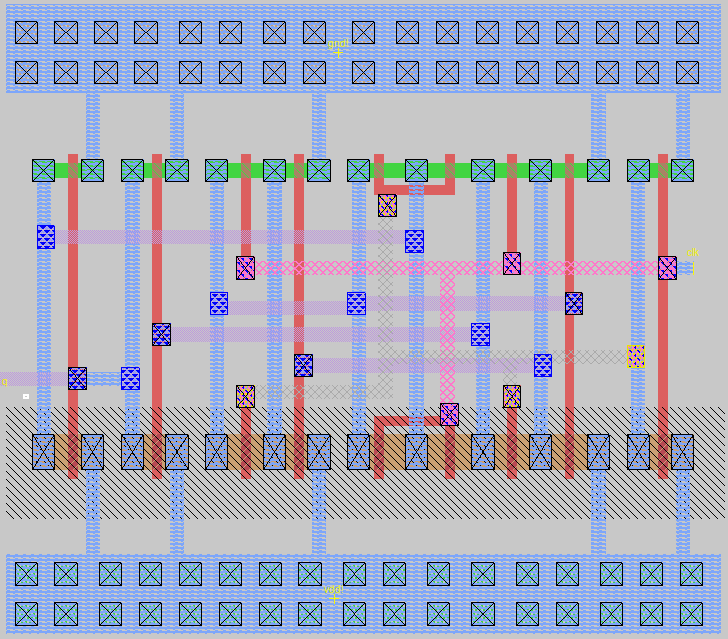

Output
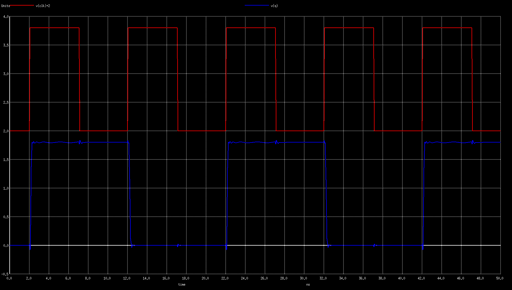

#### Divide by eight

File : [```post_layout/freqdiv8/freq_divider8.mag```](post_layout/freqdiv8/freq_divider8.mag)

Layout
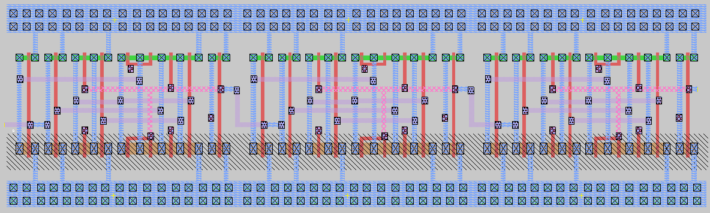

Output
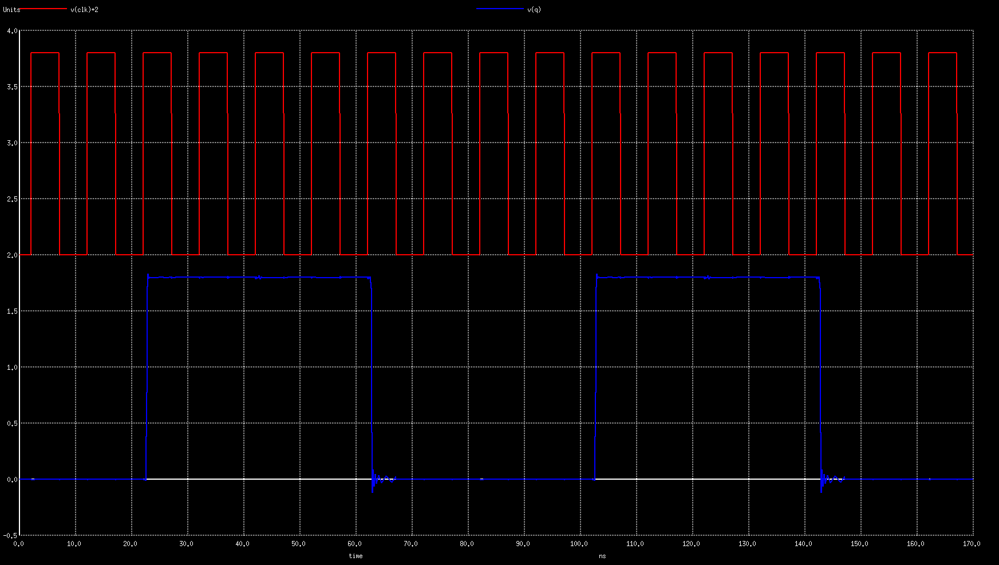


Signals

1) ```Input clock```
2) ```Output clock```

---

### 4) Multiplexer

File : [```post_layout/mux21/mux21.mag```](post_layout/mux21/mux21.mag)

Layout
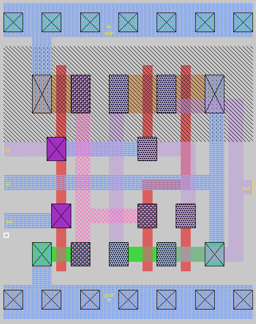

Output
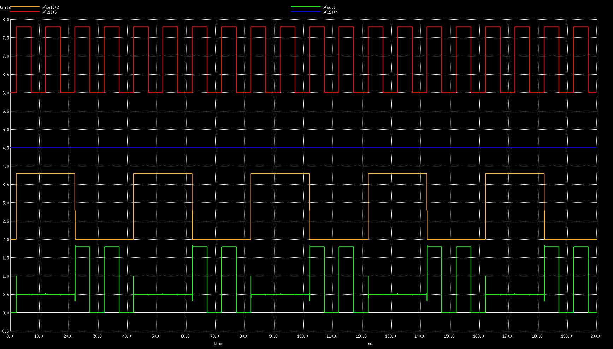

Signals
1) ```Input 0```
2) ```Input 1```
3) ```Select signal```
4) ```Output signal```

---

### 4) Whole PLL

File : [```post_layout/PLL/pll.mag```](post_layout/PLL/pll.mag)

Layout
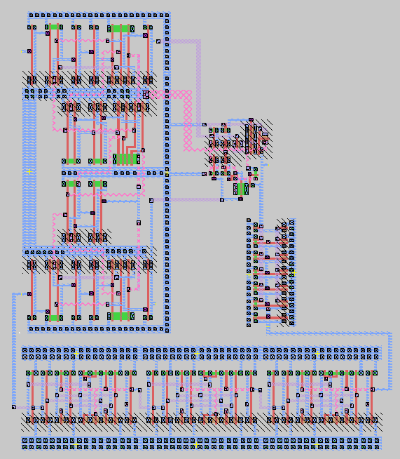

Top left : Phase detector

Top right : Charge pump and filter

Middle right : Voltage controlled oscillator

Bottom : Clock divider

Output
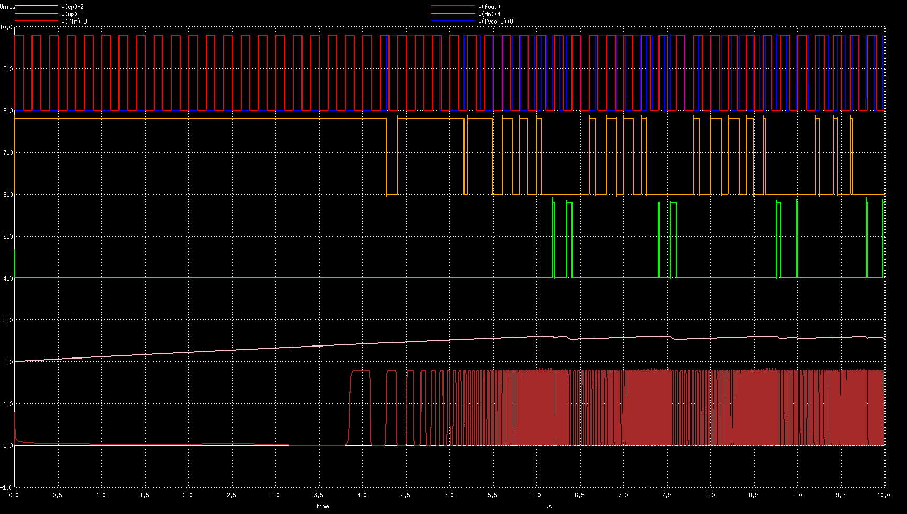

Zoomed version
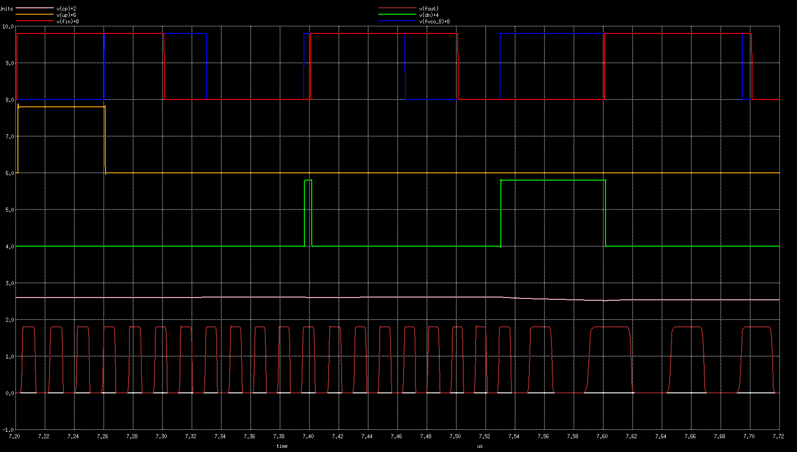

Signals

1) ```Reference clock``` in red and ```Feedback clock``` (ater clock divider) in blue
2) ```UP``` signal
3) ```DOWN``` signal
4) ```VCO input```
5) ```VCO output```

We can see that reference and feedback clocks are aligned well and output clock is roughly 8 times the frequency of the input clock.

Error (filtered input to VCO) waveform
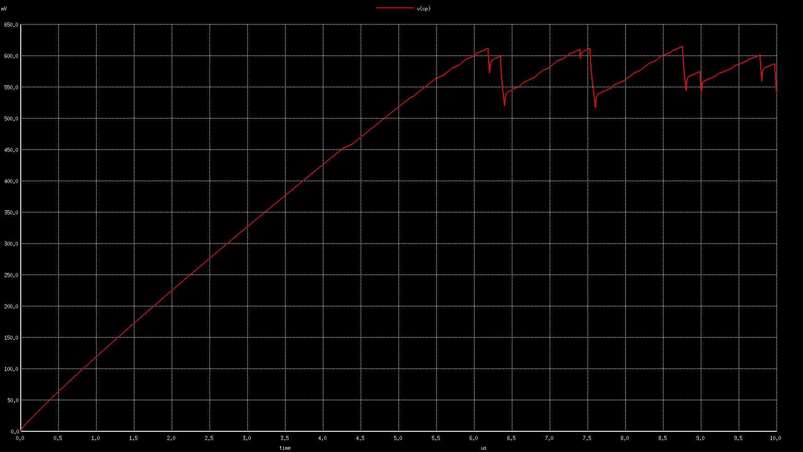

We can see how the error rises from zero and then after PLL locks to the frequency, it has some oscillations.

---

# References

1) [PLL design for OSU 180nm, paras gidd](https://github.com/parasgidd/avsdpll_3v3#1-introduction-to-On-chip-clock-multiplier)
2) [Magic tutorial](https://www.youtube.com/watch?v=D32woicgdRk)
