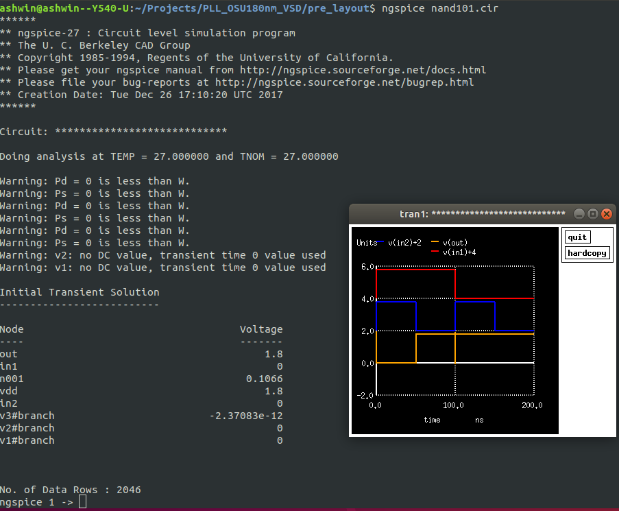
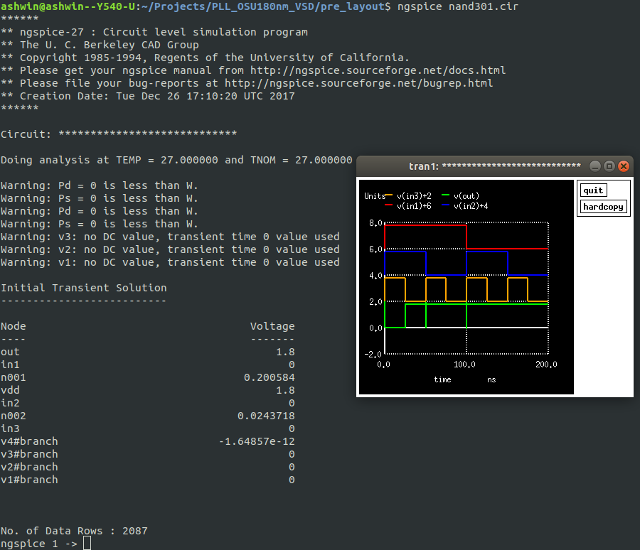
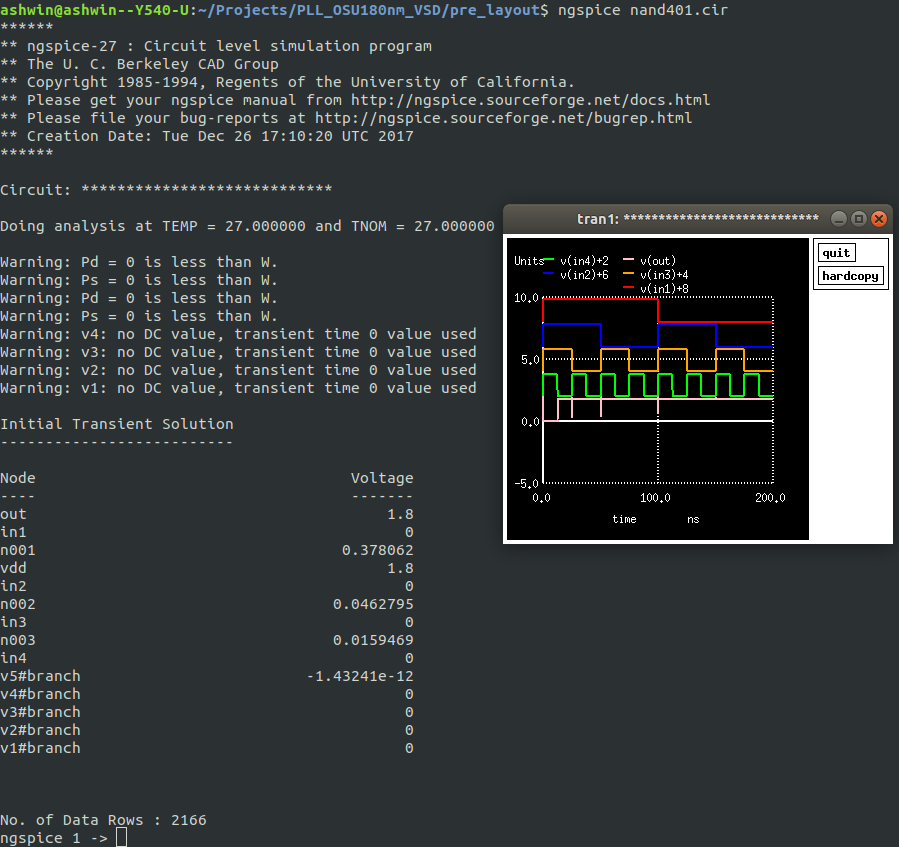

# PLL_OSU180nm_VSD
Documentation of work done for On-Chip clock multiplier / PLL workshop for OSU 180nm node by VSD for VSD Open 2021

---

## Introduction

- PLL : Phase Locked Loop
- Clock multiplier is a circuit that multiplies the frequency of a clock signal
- It is used in processors for generating variable clock frequencies
- Clock multipliers use PLLs with clock dividers in the feedback loop

---

## Tools used

- ```esim``` : Used to create spice netlists. Developed by FOSSEE group at IITB
- ```Magic``` : An open source layout editor for designing layouts and generating spice netlists from them
- ```ngspice``` : An open source circuit simulator

---

## Theory

### Phase Locked Loop

A phase locked loop is a closed loop feedback system. The output is generated from a voltage controlled oscillator. The phase difference between the oscillator output and required output is measured as the error. This error is low-pass filtered and fed into the VCO. This closed loop feedback system "locks" to the frequency of the input using the phase diffence, giving it the name

Below is an abstract block diagram of the PLL


#### Clock multiplier using PLL

A PLL can be used to create a clock multiplier by adding a clock divider in the feedback loop as shown below.


#### Our implementation

Our design has some more blocks.


It has a multiplexer in the feedback loop to provide the option of directly feeding a voltage to the VCO. The phase frequency detector 

#### Phase frequency detector

The phase detector measures the phase differencce between the output clock signal and the input clock signal. It is the error computing block from a control systems point of view.


The circuit used here is :


#### Charge pump

Charge pump converts the UP, DOWN signals from the phase frequency detector to an actual voltage


---

# Pre-layout simulation

Pre-layout simulation is done using ngspice netlists generated from esim.

---

### 1) Inverter (example)

#### Esim netlist

The netlist generated from esim looks like this : 

File : [```pre_layout/esim/inv101.cir```](pre_layout/esim/inv101.cir)
```
* /home/paras/Desktop/udemypll/prelayout/esim/inv101.cir

* EESchema Netlist Version 1.1 (Spice format) creation date: Sun Jul 25 19:21:36 2021

* To exclude a component from the Spice Netlist add [Spice_Netlist_Enabled] user FIELD set to: N
* To reorder the component spice node sequence add [Spice_Node_Sequence] user FIELD and define sequence: 2,1,0

* Sheet Name: /
M2  vdd in out vdd mosfet_p		
M1  out in GND GND mosfet_n		

.end
```

#### Modifications

We need to modify this and add ```.control``` portion to do transient simulation. We also add voltage sources for power and input (V2 and V1 respectively). We also change the mosfet definitions for the PDK we use and specify the W and L parameters.

File : [```pre_layout/inv101.cir```](pre_layout/inv.cir)
```spice
****************************
*Inverter
***************************

.include osu018.lib

M1 out in GND GND nfet l=180n w=180n
M2 VDD in out VDD pfet l=180n w=360n

V1 in 0 PULSE 0 1.8 10p 50p 50p 100n 200n
v2 VDD 0 1.8


.control
tran 0.01ns 400ns
plot v(in)+2 v(out)
.endc

.end
```

#### Running simulation

We run the simulation by invkiing the command ```ngspice inv.cir``` where ```inv.cir``` is the name of the spice netlist. The output looks like :


---

### 3) NAND gates

The phase detector requires NAND gate models. We simulate these too using esim and ngspice. The files are 

#### 2 input NAND

File : [Click here](./pre_layout/nand101.cir)

Output : 
```
ashwin@ashwin--Y540-U:~/Projects/PLL_OSU180nm_VSD/pre_layout$ ngspice nand101.cir 
******
** ngspice-27 : Circuit level simulation program
** The U. C. Berkeley CAD Group
** Copyright 1985-1994, Regents of the University of California.
** Please get your ngspice manual from http://ngspice.sourceforge.net/docs.html
** Please file your bug-reports at http://ngspice.sourceforge.net/bugrep.html
** Creation Date: Tue Dec 26 17:10:20 UTC 2017
******

Circuit: ****************************

Doing analysis at TEMP = 27.000000 and TNOM = 27.000000

Warning: Pd = 0 is less than W.
Warning: Ps = 0 is less than W.
Warning: Pd = 0 is less than W.
Warning: Ps = 0 is less than W.
Warning: Pd = 0 is less than W.
Warning: Ps = 0 is less than W.
Warning: v2: no DC value, transient time 0 value used
Warning: v1: no DC value, transient time 0 value used

Initial Transient Solution
--------------------------

Node                                   Voltage
----                                   -------
out                                        1.8
in1                                          0
n001                                    0.1066
vdd                                        1.8
in2                                          0
v3#branch                         -2.37083e-12
v2#branch                                    0
v1#branch                                    0


No. of Data Rows : 2046
ngspice 1 -> 
```


#### 3 input NAND

File : [Click here](./pre_layout/nand101.cir)

Output 
```
ashwin@ashwin--Y540-U:~/Projects/PLL_OSU180nm_VSD/pre_layout$ ngspice nand301.cir 
******
** ngspice-27 : Circuit level simulation program
** The U. C. Berkeley CAD Group
** Copyright 1985-1994, Regents of the University of California.
** Please get your ngspice manual from http://ngspice.sourceforge.net/docs.html
** Please file your bug-reports at http://ngspice.sourceforge.net/bugrep.html
** Creation Date: Tue Dec 26 17:10:20 UTC 2017
******

Circuit: ****************************

Doing analysis at TEMP = 27.000000 and TNOM = 27.000000

Warning: Pd = 0 is less than W.
Warning: Ps = 0 is less than W.
Warning: Pd = 0 is less than W.
Warning: Ps = 0 is less than W.
Warning: v3: no DC value, transient time 0 value used
Warning: v2: no DC value, transient time 0 value used
Warning: v1: no DC value, transient time 0 value used

Initial Transient Solution
--------------------------

Node                                   Voltage
----                                   -------
out                                        1.8
in1                                          0
n001                                  0.200584
vdd                                        1.8
in2                                          0
n002                                 0.0243718
in3                                          0
v4#branch                         -1.64857e-12
v3#branch                                    0
v2#branch                                    0
v1#branch                                    0


No. of Data Rows : 2087
ngspice 1 -> exit
```



#### 4 input NAND

File : [click here](pre_layout/nand401.cir)

```
ashwin@ashwin--Y540-U:~/Projects/PLL_OSU180nm_VSD/pre_layout$ ngspice nand401.cir
******
** ngspice-27 : Circuit level simulation program
** The U. C. Berkeley CAD Group
** Copyright 1985-1994, Regents of the University of California.
** Please get your ngspice manual from http://ngspice.sourceforge.net/docs.html
** Please file your bug-reports at http://ngspice.sourceforge.net/bugrep.html
** Creation Date: Tue Dec 26 17:10:20 UTC 2017
******

Circuit: ****************************

Doing analysis at TEMP = 27.000000 and TNOM = 27.000000

Warning: Pd = 0 is less than W.
Warning: Ps = 0 is less than W.
Warning: Pd = 0 is less than W.
Warning: Ps = 0 is less than W.
Warning: v4: no DC value, transient time 0 value used
Warning: v3: no DC value, transient time 0 value used
Warning: v2: no DC value, transient time 0 value used
Warning: v1: no DC value, transient time 0 value used

Initial Transient Solution
--------------------------

Node                                   Voltage
----                                   -------
out                                        1.8
in1                                          0
n001                                  0.378062
vdd                                        1.8
in2                                          0
n002                                 0.0462795
in3                                          0
n003                                 0.0159469
in4                                          0
v5#branch                         -1.43241e-12
v4#branch                                    0
v3#branch                                    0
v2#branch                                    0
v1#branch                                    0


No. of Data Rows : 2166
ngspice 1 -> 
```



---

### 2) Phase detector

The spice netlist for the phase detector is in this file : [```pre_layout/pfd.cir```](pre_layout/pll.cir)

It 
